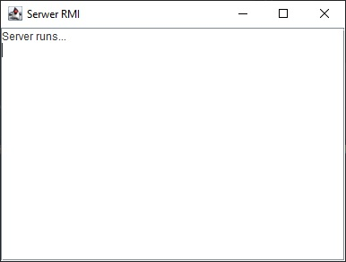
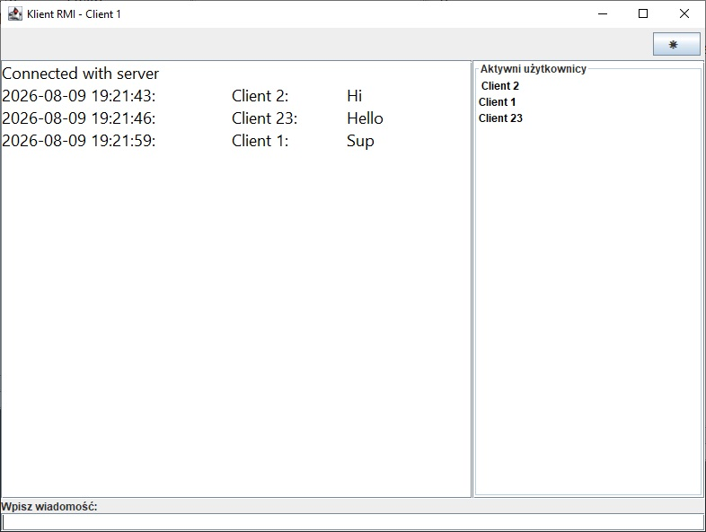

# Java-RMI-Chat
A multi-client chat application developed in Java using **Java RMI (Remote Method Invocation)**.

The application follows a client-server architecture and allows multiple clients to connect to a central server and exchange messages. Both the client and server include graphical user interfaces.

> **Academic project:** developed as a team assignment during university studies.

## Features

* Client-server communication using Java RMI
* Support for multiple connected clients
* Graphical user interface for the client and server
* Sending and receiving chat messages
* Displaying the list of actually connected users
* Message observer mechanism
* Saving chat logs to a file
* Client, server version without GUI

## Technologies

* **Java**
* **Java RMI**
* **Client-Server Architecture**
* **GUI**
* **Observer Pattern**

## Project Structure

```text
Java-RMI-Chat/
│
├── ClientPackage/
│   ├── Klient.java
│   ├── KlientGUIMulti.java
│
├── ServerPackage/
|   ├── Funkcje.java
│   ├── FunkcjeImp.java
│   ├── LogWriter.java
│   ├── MessageObserver.java
│   ├── Server.java
│   ├── ServerGUI.java
│
├── .gitignore
├── Main.java 
├── README.md
├── diagramklas.png
└── diagramklas.puml
```

## Architecture

The application is divided into two main components: **client** and **server**.

The server is responsible for managing connected clients and providing remote functionality through Java RMI. Clients use the remote interfaces to communicate with the server and exchange messages.

### Client

The client package contains:

* **Klient** — client implementation without a graphical interface
* **KlientGUIMulti** — GUI client containing the main client functionality
* **MessageObserver** — handles message-related notifications

### Server

The server package contains:

* **Server** — main server component
* **ServerGui** — graphical interface for the server
* **FunkcjeImp** — implementation of the server-side functionality
* **IFunkcje** — remote interface containing methods available to clients
* **IMessageObserver** — interface used for message and user-related notifications
* **LogWriter** — responsible for writing chat logs

## Communication

The application uses **Java RMI (Remote Method Invocation)** to enable communication between clients and the server.

The server-side functionality is implemented by `FunkcjeImp`. It implements the remote `Funkcje` interface. Clients use this interface to invoke remote methods provided by the server.

Connected clients implement the `MessageObserver` interface. `FunkcjeImp` keeps track of connected clients through `MessageObserver` and uses its `sendMessage` method to deliver messages to the sender and recipient.

### UML Diagram

The project includes a UML diagram created using **PlantUML**.

The source file is available in:

```text
diagramklas.puml
```

Also there's a photo of UML diagram:


## Logging

The application includes the `LogWriter` component, which is responsible for saving chat activity to file `chat_history.txt`.

This provides a record of communication taking place within the application.

## Screenshots

### Server

The server application running with its graphical interface.



### Client

The GUI client with exchanged chat messages.



## Running the Application

The project was developed and tested using **IntelliJ IDEA**.

There are two ways to run the application:

### Using `Main.java`

Run `Main.java` to start the server and the GUI clients. On the start you will be asked to enter the number of clients and their names.

### Running the components separately

The server and client can also be started independently, allowing multiple client instances to connect to the server.

* Run the server application.
* Run `Klient.java` and `Server.java` or `KlientGUIMulti.java` and `ServerGUI.java`.
* Run another client instances to add multiple users to chat.
* Exchange messages between connected clients.

## My Contribution

The project was developed as a team assignment.

My contribution included:

* implementing and extending selected application functionalities,
* working on the graphical user interface,
* implementing chat logging using `LogWriter`,
* testing the application and its functionality,
* preparing project documentation,
* proposing ideas for additional functionality,
* identifying and fixing issues during development and testing.

The project was developed collaboratively, so individual components were not developed exclusively by a single team member.

## Project Purpose

The project was created as part of a university course to gain practical experience with distributed applications and remote communication.

The main goal was to implement a multi-client chat application using Java RMI and understand how clients can communicate with a central server through remotely invoked methods.

## Project Status

**Completed — academic team project.**
